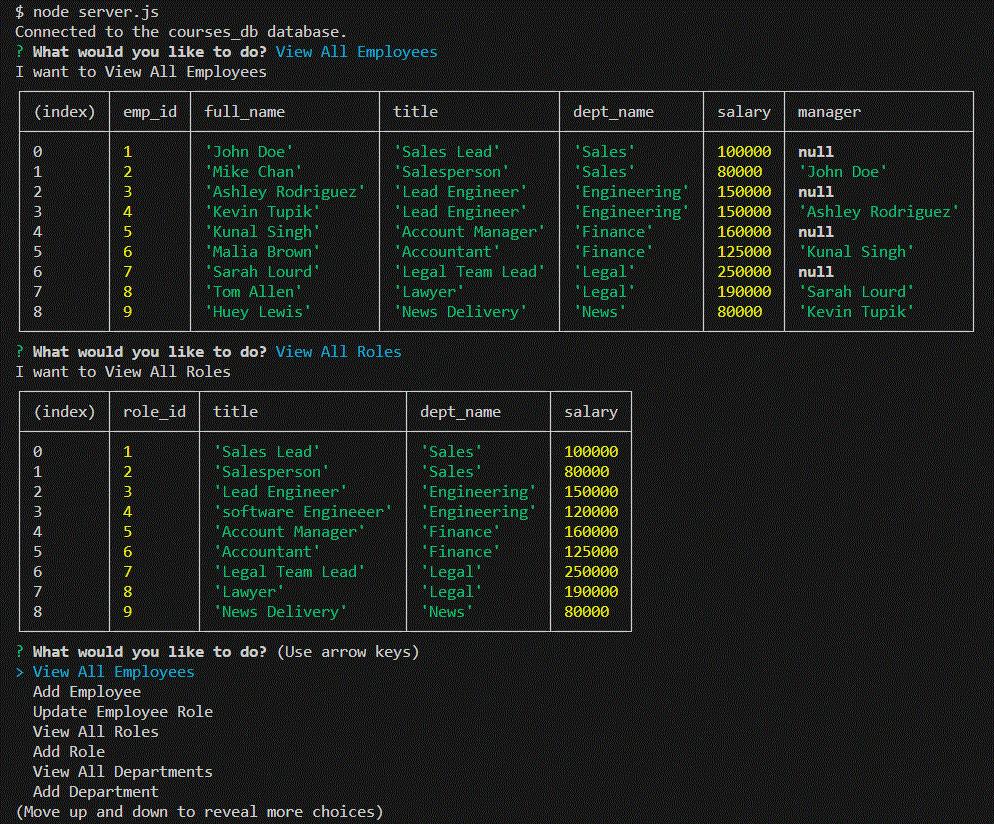

# Personnel Database
Module 12 Challenge

## Description

The repository holds files to create a database, tables, and seed data that can function as a employee record
  1) The user is presented with a list of options on how to interact with the database.
  2) User can view contents of the database as well as add new data

## Installation

Contains\
  server.js\
  The /db directory contains a schema to create the database and tables, along with a seed file
  package.json for adding packages

  Use the schema to manually create database and tables within Workbench or other SQL tool.
  Enter the data in the seed file in same SQL tool.
  At command line, start the script with command:
  > node server.js

## Screenshot

## Video of demonstration at https://youtu.be/VaFbOQoAQww

## Repository at https://github.com/petemaynard/personnel_database

## Credits

Created by Pete Maynard
with some assistance from tutor Dru Sanchez

